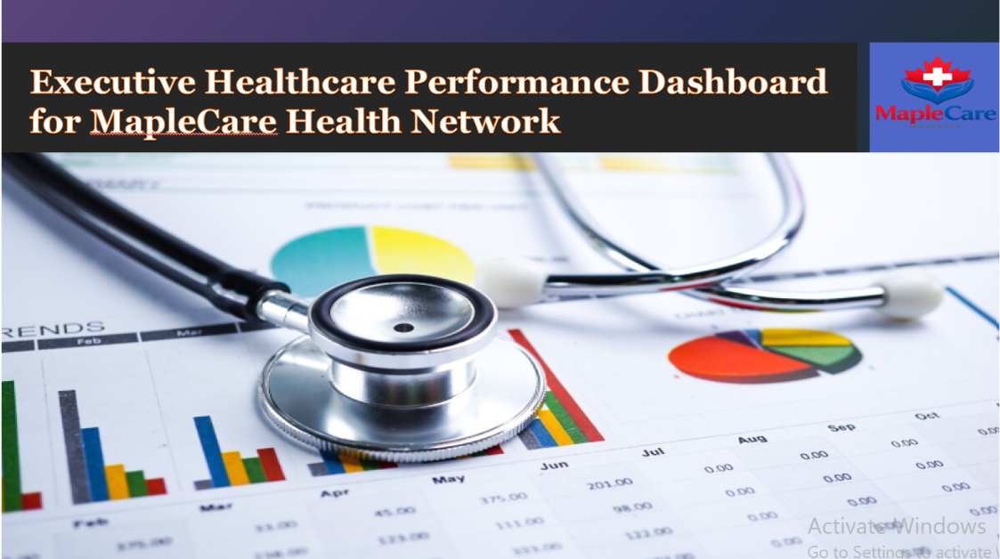
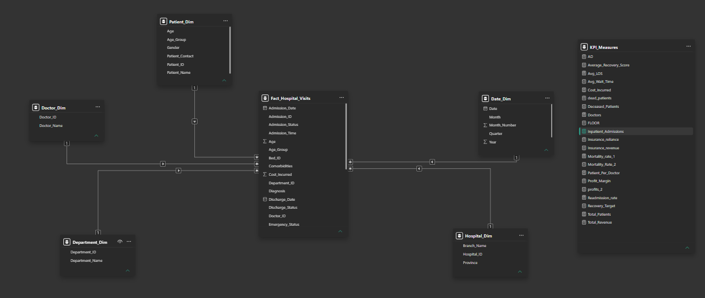
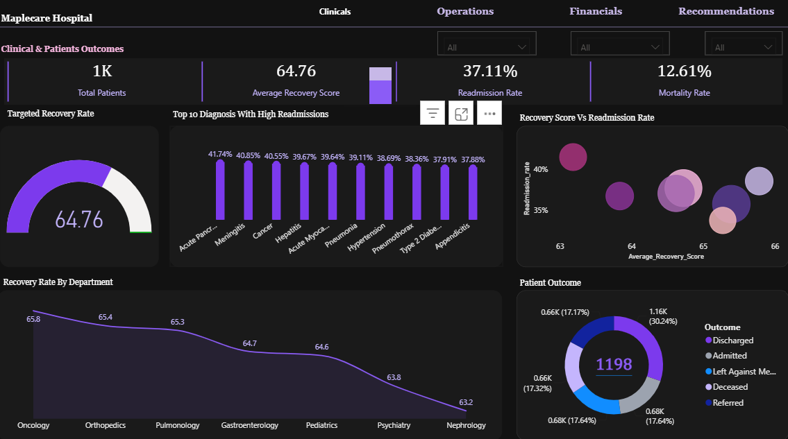
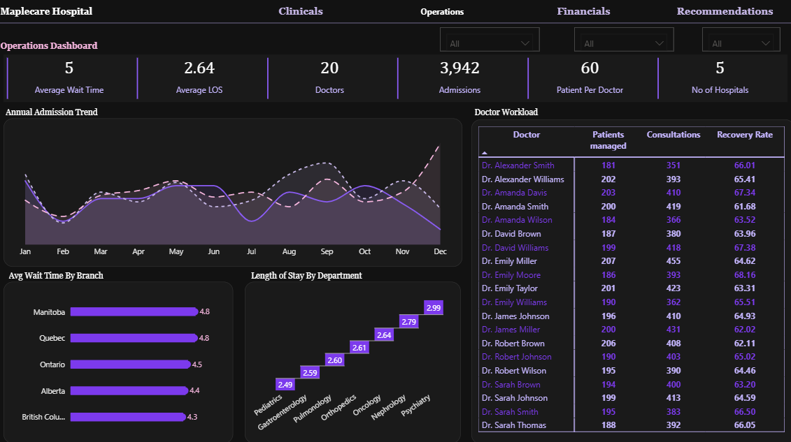
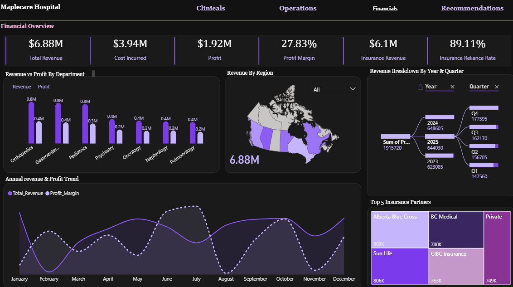

<div align="center">

# # 🏥 MapleCare Hospital Performance Analytics

### Executive Power BI Dashboard for Clinical, Operational & Financial Intelligence

**Transforming hospital data into actionable insights for healthcare leaders through interactive dashboards, KPI monitoring, and performance analytics.**


<br>



<br><br>

**[📄 PDF Report](./documentation/MapleCare_Hospital_Analysis.pdf)** · **[📊 PBIX File](./MapleCare_Hospital_Dashboard.pbix)** · **[🖼️ Screenshots](./assets/screenshots/)** · **[✉️ Contact](#-about-the-author)**

</div>

<br>

---

## 📌 Executive Summary

A multi-branch hospital network operates three interdependent layers at once: the clinical layer (are patients recovering, and how often are they coming back?), the operational layer (are branches running efficiently, and are doctors and beds being used well?), and the financial layer (is the network profitable, and how dependent is it on any single revenue source?). When each layer is reported separately — clinical audits here, ops spreadsheets there, finance decks somewhere else — leadership never sees the full picture, and decisions get made one silo at a time.

This project delivers a **three-page executive Power BI dashboard** for MapleCare Health Network, a five-branch hospital system spanning Manitoba, Quebec, Ontario, Alberta, and British Columbia. It unifies **Clinical & Patient Outcomes, Operations, and Financials** into one connected model, giving executives a single place to monitor recovery and readmission trends, staffing and wait-time efficiency, and revenue/profit performance — down to the department, branch, and doctor level.

**Business value delivered:**
- A network-wide view of **patient outcomes, readmissions, and mortality** by department
- Operational visibility into **wait times, length of stay, and doctor workload** across all five branches
- A consolidated **revenue, cost, and profit margin** view, including insurance-partner dependency risk
- A benchmarking layer that lets leadership identify high-performing branches and departments and replicate what's working elsewhere

<br>

---

## 🎯 Business Challenge

Hospital networks generate clinical, operational, and financial data continuously, but rarely in a form that lets leadership act on it quickly. Common pain points include:

| Challenge | Business Impact |
|---|---|
| **Fragmented Performance Reporting** | Clinical, operations, and finance teams typically report in isolation, so no one sees how a readmission spike in one department relates to cost or revenue impact |
| **Readmission & Mortality Blind Spots** | Without department-level readmission tracking, quality issues surface only after they've become a pattern |
| **Resource & Staffing Inefficiency** | Doctor workload and wait times are hard to compare across branches without a consolidated model, making it difficult to rebalance staffing |
| **Branch Benchmarking** | Best practices at high-performing branches rarely get identified or replicated network-wide without side-by-side comparison |
| **Revenue Concentration Risk** | Heavy reliance on a small number of insurance partners is easy to miss without a dedicated payer-mix view |
| **Slow, Manual Executive Reporting** | Recreating monthly performance packs from spreadsheets delays decision-making and limits the questions leadership can explore |

**Why spreadsheets alone fall short:** clinical, operational, and financial data typically live in separate extracts with no shared relationships — so answering a cross-functional question like *"which department is both the least profitable and the highest-readmission?"* requires manual reconciliation every single time. A modeled BI solution removes that friction permanently.

<br>

---

## 🎯 Business Objectives

## Objectives

- Monitor patient outcomes and recovery performance.
- Evaluate readmission and mortality trends.
- Track operational efficiency across hospital branches.
- Analyze doctor workload and patient distribution.
- Monitor financial performance and profitability.
- Compare departmental performance.
- Support executive decision-making through interactive dashboards.

<br>

---

## 🗂️ Dataset Overview

| Dataset | Description | Role in Model |
|---|---|---|
| **Patients** | Patient-level records including outcome status, department, and diagnosis | Core dimension for clinical outcome analysis |
| **Admissions** | Admission and discharge events, including length of stay and outcome | Fact table driving operational and clinical metrics |
| **Departments** | Clinical departments (Oncology, Orthopedics, Pulmonology, Gastroenterology, Pediatrics, Psychiatry, Nephrology) | Dimension for department-level benchmarking |
| **Doctors** | Doctor roster with patients managed, consultations, and recovery outcomes | Dimension for staffing and workload analysis |
| **Branches** | The five hospital branches by Canadian province | Dimension for geographic/branch benchmarking |
| **Financials** | Revenue, cost, and profit transactions by department, branch, and insurance partner | Fact table for financial performance analysis |
| **Insurance Partners** | Payer entities (Alberta Blue Cross, Sun Life, BC Medical, CIBC Insurance, Private) | Dimension for payer-mix and reliance analysis |
| **Date** | Calendar table for time intelligence | Enables monthly, quarterly, and annual trend analysis |

<br>

---

## 🧩 Data Model

The model follows a **star schema**: `Admissions` and `Financials` act as fact tables, connected to `Patients`, `Departments`, `Doctors`, `Branches`, `Insurance Partners`, and `Date` dimension tables. This lets clinical, operational, and financial visuals all pull from a single consistent set of relationships rather than siloed, page-specific calculations.

<div align="center">

</div>

**Why a star schema:** it lets the same `Departments` and `Branches` dimensions drive both clinical KPIs (recovery, readmission) and financial KPIs (revenue, profit) consistently, which is what makes cross-functional questions ("which department is underperforming clinically *and* financially?") answerable in a single visual.

<br>

---

## ⚙️ Technical Architecture

| Layer | Implementation |
|---|---|
| **Data Cleaning & Transformation** | Power Query used to standardize department and branch names, resolve outcome categories, and handle missing values |
| **Data Modeling** | Star schema with `Admissions` and `Financials` as fact tables against shared dimensions |
| **DAX Measures** | Custom measure layer for Recovery Score, Readmission Rate, Mortality Rate, Length of Stay, Profit Margin, and Insurance Reliance Rate |
| **KPI Cards** | Headline card visuals on every page for at-a-glance executive monitoring |
| **Interactive Filtering** | Slicers for Department, Branch, and Year/Quarter applied consistently across pages |
| **Navigation** | Persistent top navigation bar linking Clinicals, Operations, and Financials pages |
| **Time Intelligence** | Year-over-year and quarter-over-quarter DAX calculations for revenue and profit trending |
| **Performance Optimization** | Star schema design to keep the model lean and queries fast as admission and financial history grows |

<br>

---

## 📊 Dashboard Walkthrough

<details open>
<summary><b>1️⃣ Clinical & Patient Outcomes</b></summary>

<br>

**Purpose:** Give leadership a real-time view of patient outcomes and clinical quality across the network.

**Business Questions Answered:**
- What is our overall recovery score, readmission rate, and mortality rate?
- Which departments have the strongest and weakest recovery outcomes?
- Which diagnoses are driving the highest readmission rates?
- How are patient outcomes distributed (discharged, admitted, referred, deceased, left against medical advice)?

**Key KPIs:** Total Patients (1,198) · Average Recovery Score (64.76) · Readmission Rate (37.11%) · Mortality Rate (12.61%)

**Visualizations Used:** KPI cards, recovery rate by department bar chart, top 10 diagnoses with high readmissions bar chart, patient outcome donut, recovery score vs. readmission rate scatter plot

**Business Value:** Pinpoints exactly which diagnoses and departments are driving readmissions, giving clinical leadership a prioritized, evidence-based starting point for quality improvement initiatives rather than a network-wide guess.

<div align="center">

</div>

</details>

<details>
<summary><b>2️⃣ Operations</b></summary>

<br>

**Purpose:** Monitor staffing efficiency, patient flow, and branch-level operational performance.

**Business Questions Answered:**
- How long are patients waiting, and how does that vary by branch?
- What is our average length of stay, and which departments run longest?
- How is doctor workload distributed, and is it balanced against recovery outcomes?
- How have admissions trended over the year?

**Key KPIs:** Average Wait Time (5 days) · Average Length of Stay (2.64 days) · Doctors (20) · Admissions (3,942) · Patients per Doctor (60) · Number of Hospitals (5)

**Visualizations Used:** KPI cards, annual admission trend line chart, average wait time by branch bar chart, length of stay by department bar chart, doctor workload detail table (patients managed, consultations, recovery rate per doctor)

**Business Value:** Makes staffing imbalances visible immediately — branches with the longest wait times and departments with the longest length of stay stand out clearly, giving operations leadership a direct lever for rebalancing resources.

<div align="center">

</div>

</details>

<details>
<summary><b>3️⃣ Financials</b></summary>

<br>

**Purpose:** Track network-wide revenue, cost, and profitability, including payer concentration risk.

**Business Questions Answered:**
- What is our total revenue, cost, and profit, and how healthy is our margin?
- How dependent are we on insurance revenue versus other sources?
- Which departments and branches generate the most revenue and profit?
- Who are our top insurance partners, and how concentrated is that dependency?

**Key KPIs:** Total Revenue ($6.88M) · Cost Incurred ($3.94M) · Profit ($1.92M) · Profit Margin (27.83%) · Insurance Revenue ($6.1M) · Insurance Reliance Rate (89.11%)

**Visualizations Used:** KPI cards, annual revenue & profit trend line chart, revenue vs. profit by department chart, revenue by region map/chart, revenue breakdown by year & quarter, top 5 insurance partners bar chart

**Business Value:** A profit margin near 28% alongside an insurance reliance rate above 89% flags a real concentration risk — the network's financial health is heavily tied to a small number of payers, which is exactly the kind of insight a static spreadsheet report would bury.

<div align="center">

</div>

</details>

<br>

---

## 📖 KPI Dictionary

| KPI | Definition |
|---|---|
| **Recovery Score** | A composite clinical score reflecting patient recovery outcomes, averaged by department or network-wide |
| **Readmission Rate** | The percentage of discharged patients who were readmitted within the tracked window — a core clinical quality indicator |
| **Mortality Rate** | The percentage of admitted patients whose outcome was deceased |
| **Average Wait Time** | The average number of days between patient arrival and admission/treatment |
| **Average Length of Stay (LOS)** | The average number of days a patient remains admitted per visit |
| **Patients per Doctor** | Total patients managed divided by total doctors — a staffing-load indicator |
| **Total Revenue** | Total income generated across all branches, departments, and payer sources |
| **Profit Margin** | Profit divided by Total Revenue — the core measure of financial efficiency |
| **Insurance Reliance Rate** | The percentage of total revenue sourced from insurance payers versus other revenue streams |

<br>

---

## 💡 Business Insights

- **Readmissions are concentrated in a small set of high-acuity diagnoses.** Acute Pancreatitis, Meningitis, and Cancer top the readmission list — all conditions where post-discharge care coordination is known to matter most, making them a clear starting point for intervention.
- **Recovery outcomes are fairly consistent across departments** (roughly 63–66 on the recovery score), with Oncology and Psychiatry showing marginally stronger outcomes than Orthopedics and Pediatrics — a narrow enough spread that any one department slipping is worth investigating rather than dismissing as normal variance.
- **Wait times vary meaningfully by branch**, with Manitoba and Quebec running noticeably longer than British Columbia — a strong candidate for a staffing or scheduling review at the slower branches.
- **Length of stay is shortest in Pediatrics and longest in Psychiatry and Nephrology**, consistent with clinical expectations but worth monitoring for cost impact given LOS is a direct driver of cost per admission.
- **The network is financially healthy but payer-concentrated.** A ~28% profit margin is solid, but an 89% insurance reliance rate — with the top five insurance partners accounting for the bulk of that — represents a real dependency risk if any single payer relationship changes.
- **Revenue and profit are not evenly distributed across departments**, with Orthopedics and Gastroenterology contributing disproportionately to both — useful evidence for where investment and capacity expansion would have the greatest financial return.

<br>

---

## 🧭 Strategic Recommendations

1. **Improve patient flow and reduce wait times** by reviewing admission scheduling, staffing levels, and resource allocation at branches with consistently long waiting periods.
2. **Optimize resource utilization** by balancing bed occupancy, doctor workloads, and departmental capacity to reduce operational bottlenecks and improve service delivery.
3. **Strengthen quality of care** by monitoring departments with high readmission rates and lower recovery scores, and implementing targeted clinical improvement initiatives where necessary.
4. **Enhance financial performance** by closely tracking treatment costs, improving cost efficiency in high-expense departments, and adopting best practices from the most profitable branches.
5. **Leverage performance benchmarking** across hospital branches to identify high-performing facilities and replicate successful operational and clinical practices throughout the network.
6. **Institutionalize executive performance monitoring** through an interactive dashboard that provides real-time visibility into clinical, operational, and financial KPIs, enabling faster, data-driven decision-making.
7. **Diversify payer mix** to reduce reliance on the top insurance partners and limit revenue concentration risk.

<br>

---

## 🛠️ Skills Demonstrated

| | |
|---|---|
| 📊 **Business Intelligence** | End-to-end BI solution spanning clinical, operational, and financial domains |
| ⚡ **Power BI** | Multi-page executive dashboard design with consistent cross-page navigation |
| 🧮 **DAX** | Custom measures for clinical and financial healthcare KPIs |
| 🔧 **Power Query** | Data cleaning, transformation, and shaping across multiple source tables |
| 🗃️ **Data Modeling** | Star schema design connecting clinical, operational, and financial fact tables |
| 🏥 **Healthcare Analytics** | Readmission, recovery, mortality, and length-of-stay analysis |
| 💰 **Financial Analytics** | Revenue, cost, profit margin, and payer-concentration analysis |
| 📖 **Data Storytelling** | Translating cross-functional KPIs into a coherent executive narrative |
| 🧑‍💼 **Executive Reporting** | Designing for a non-technical, decision-making audience |
| 🎨 **Dashboard Design** | Clean, benchmarking-ready, multi-page report UX |

<br>

---

## 📁 Repository Structure

```
maplecare-health-network-dashboard/
│
├── README.md
├── LICENSE
├── MapleCare_Hospital_Dashboard.pbix
│
├── documentation/
│   ├── MapleCare_Hospital_Analysis.pdf
│   ├── Data_Dictionary.md
│   └── DAX_Measures.md
│
└── assets/
    └── screenshots/
        ├── cover-image.png
        ├── data-model.png
        ├── 01-clinical-patient-outcomes.png
        ├── 02-operations.png
        └── 03-financials.png
```

<br>

---

## 🚀 Future Improvements

- [ ] **Predictive Readmission Risk Scoring** — Model-driven flagging of patients at elevated readmission risk at the point of discharge
- [ ] **Staffing Forecast Model** — Predictive doctor-per-patient demand forecasting by branch and season
- [ ] **AI-Generated Executive Summaries** — Natural-language narrative insights layered on top of the existing model
- [ ] **Row-Level Security (RLS)** — Branch-level access control so each hospital only sees its own detailed data
- [ ] **Incremental Refresh** — Optimize refresh performance as admission and financial history grows
- [ ] **Payer Risk Dashboard** — A dedicated view tracking insurance reliance trends over time

<br>

---

## 👤 About the Author

### Oluwasegun Shobowale

*Business Intelligence Analyst | SQL | Power BI | Data Analytics | Business Intelligence*

I'm a Business Intelligence and Data Analytics professional passionate about transforming complex data into actionable insights. I build interactive dashboards, develop scalable data models, and create analytical solutions that help organizations make informed business decisions.

My experience spans healthcare, insurance, public health, and business analytics, with expertise in SQL, Power BI, DAX, Power Query, and dimensional data modeling. Beyond analytics, I enjoy teaching and mentoring aspiring data professionals, designing real-world case studies, and helping organizations use data more effectively.

I'm currently focused on building practical analytics solutions and sharing projects that demonstrate how data can solve real business problems.

[](https://github.com/oluwasegun-j)
[](https://www.linkedin.com/in/segunshobo/)
[](https://jumpy-dewberry-4b8.notion.site/Oluwasegun-Shobowale-2be03309cd84808dab84f16eb1dfeed0)
[](https://medlytics-insights.vercel.app/)


<br>

---

<div align="center">

*This project is part of a broader analytics portfolio spanning healthcare, insurance, and business intelligence.*

**⭐ If this project is useful, consider starring the repository.**

</div>
